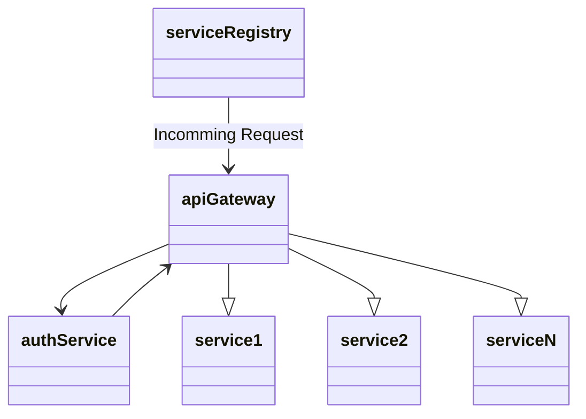

# Microservices with Spring Boot!

This repo contains high-level implementation of microservice architecture.
The group here (in laymen terms) can be understood as a large container, having multiple microservices within it. It has 5 microservices within; whose responsibilities are:



- **service-registry** - Eureka Server to act as an umbrella for all other services. Other service will register with this. But why ? => To easily communicate with each other. [Getting Started | Service Registration and Discovery (spring.io)](https://spring.io/guides/gs/service-registration-and-discovery/)
- **api-gateway** - Service to map incomming requests to their respective service. This is built using [Spring Cloud Gateway](https://docs.spring.io/spring-cloud-gateway/docs/current/reference/html/), [Exploring Spring Cloud Gateway](https://www.baeldung.com/spring-cloud-gateway)
- **auth-service** - Service responsible for providing authentication using [JSON Web Tokens](https://jwt.io/)
- **service-1** and **service-2** are two client microservices which altogether depict the scope of scalability.

## Functionality

There is a postman collection included.

- Obtain a token from [get-new-token](http://localhost:3000/service/auth/token) using {"username": "name1","password": "pass1"} as request body. The username and passwords are hardcoded into **auth-service** for now.
- use that token to access rest of the methods from this collection. Added token validation to **api-gateway** as well to reduce network calls.
- remember [service-1-direct-greet](http://localhost:4001/greet) does not goes through **api-gateway** and hence does not requires authentication as of now.
- The resigtering of different services to **service-registry** can be observed through [Local Eureka Dashboard](http://localhost:8761/)

## Observability

### Nginx
Included [nginx.conf](./nginx.conf) helps to expose services running on localhost to local network.
```sh
brew install nginx
# modify it with help of included nginx.conf - /opt/homebrew/etc/nginx/nginx.conf
nginx -t
brew services start nginx
brew services list
brew services stop nginx
```

### Prometheus
- [prometheus.yml](./prometheus/prometheus.yml) - ensure targets are updated here
- Hot reload prometheus - `curl -X POST http://localhost:9090/-/reload`

### Startup
```sh
docker-compose up -d
docker-compose down
```

### Grafana
- make sure to use local-ip instead of localhost while adding prometheus as a connection into grafana.