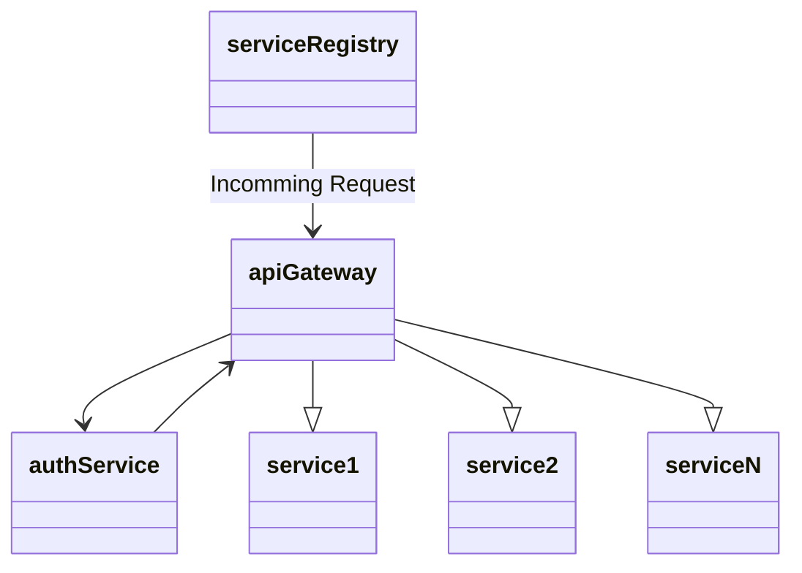

# Microservices with Spring Boot!

This repo contains high-level implementation of microservice architecture.
The group here (in laymen terms) can be understood as a large container, having multiple microservices within it. It has 5 microservices within; whose responsibilities are:

-   **service-registry** - Eureka Server to act as an umbrella for all other services. Other service will register with this. But why ? => To easily communicate with each other. [Getting Started | Service Registration and Discovery (spring.io)](https://spring.io/guides/gs/service-registration-and-discovery/)
-   **api-gateway** - Service to map incomming requests to their respective service. This is built using [Spring Cloud Gateway](https://docs.spring.io/spring-cloud-gateway/docs/current/reference/html/), [Exploring Spring Cloud Gateway](https://www.baeldung.com/spring-cloud-gateway)
-   **auth-service** - Service responsible for providing authentication using [JSON Web Tokens](https://jwt.io/)
-   **service-1** and **service-2** are two client microservices which altogether depict the scope of scalability.

## Note

-   [Local Eureka Dashboard](http://localhost:8761/)
